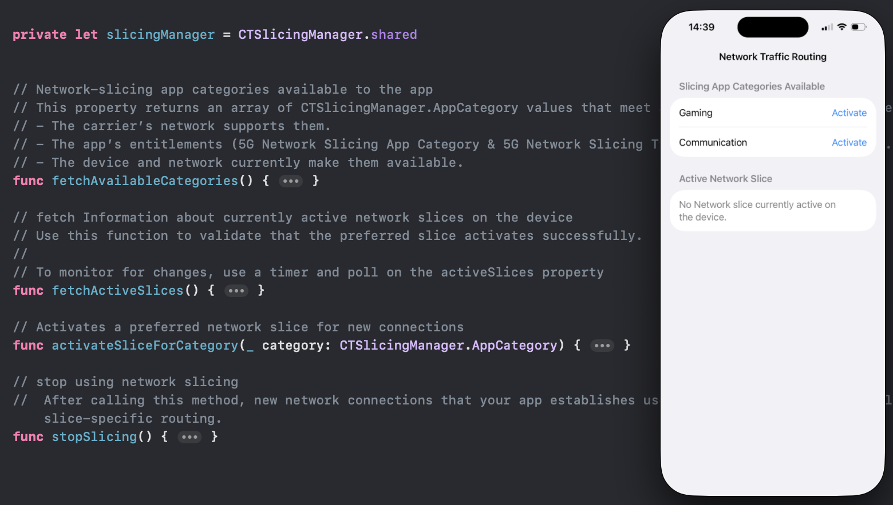

# Swift_NetworkSlicing
A demo of Control &amp; Monitor Cellular Network Traffic Routing (Network slicing)

For more details, please refer to my blog [Swift: Control & Monitor Cellular Network Traffic Routing]()

